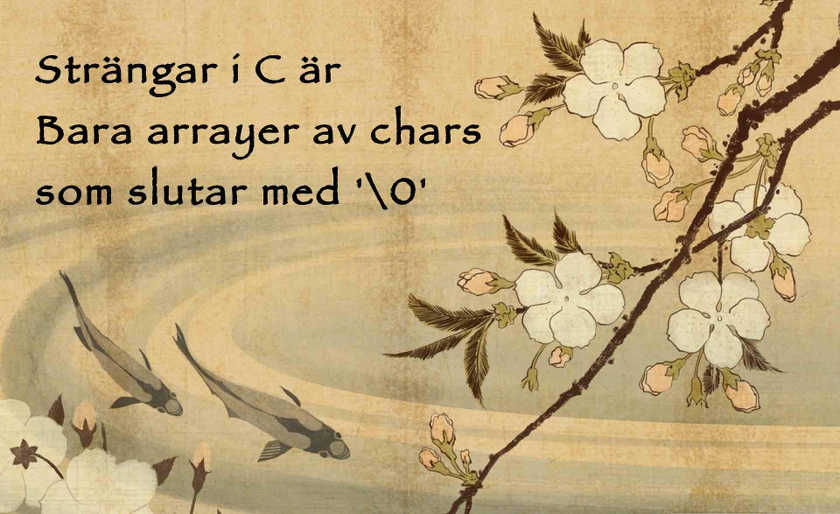

# Föreläsning 3

* [Bilder](f3.pdf) (pdf, uppdaterade 2015-09-04)
* [Screencast av delar som inte hanns med](http://youtu.be/dqlX-dH_suk)

Se även:
* [Tidigare screencasts](https://github.com/IOOPM-UU/ioopm15/tree/master/extramaterial/screencasts/fas1#screencasts-till-föreläsning-3) -
  Screencasts om strängar och `printf`/`scanf`.
* [Kom-igång-uppgiften](https://github.com/IOOPM-UU/ioopm15/tree/master/uppgifter/fas1/komigang/)
  som har övningar som rör [strängar](https://github.com/IOOPM-UU/ioopm15/tree/master/uppgifter/fas1/komigang/strings#strängar-och-tecken) och [I/O](https://github.com/IOOPM-UU/ioopm15/tree/master/uppgifter/fas1/komigang/io#io)

# Utdelad kod

Se filer i denna katalog. Generellt gäller att `foo.c` var filen
vi började med, medan `foo_fixed.c` är det färdiga resultatet.
`password_getline.c` innehåller en version av `password.c` som
använder `getline` istället för `scanf`. Notera att det kräver
att man manuellt tar bort den medföljande radbrytningen.

# Vad du själv kan göra

* Implementera delar av `string.h`. Bra övningar är:
  - `strcat`
  - `strchr`
  - `strncmp`
  - `strncpy`
  - `strncmp`
  - `strspn`
  - `strnstr`

  Kör `man strcat` (etc) för att få en beskrivning av dem.

* Skriv en funktion `rovar` som tar en sträng som input och
  översätter den till rövarspråket. I rövarspråket översätts alla
  vokaler (a, e, i, o, u, å, ä och ö) till sig själva och alla
  konsonanter `c` till `c`o`c`. "Uppsala" översätts alltså tillnn
  "Upoppopsosalola". Fundera på hur lång strängen som rymmer
  rövarspråkssträngen behöver vara i jämförelse med
  ursprungssträngen! (En lämplig skarvning kan vara att ignorera
  svenska vokaler).

* Implementera (enkla versioner av) några av de vanligaste
  terminalkommandona som hanterar text. Se
  [kom-igång-uppgiften](https://github.com/IOOPM-UU/ioopm15/tree/master/uppgifter/fas1/komigang/io#io-till-filer))
  för exempel på hur man skriver/läser till/från fil, eller skarva
  och läs bara från `stdin`.
  - `echo`
  - `cat`
  - `head`
  - `tail`
  - `grep` (för vanlig strängsökning, reguljära uttryck är svårare!)
  - `wc`

  Kör `man echo` (etc) för att få en beskrivning av dem.

* Modifiera rövarspråksprogrammet så att det läser text från
  `stdin`, översätter texten till rövarspråket och skriver den
  till `stdout`.

# Svenska tecken (tillagt 2015-09-14)

Det är inte helt enkelt att använda svenska tecken (eller några
andra tecken än vad som behövs för engelska) i de flesta programspråk.
I C kan vi med fördel använda UTF-8-standarden för att skapa
så-kallade multibyte-strängar där specialtecken som å, ä och ö
representeras med fler än ett tecken. Det medför dock t.ex. att
`strlen("åäö")` är 6 och inte 3. Inget stort problem men ibland
något förvirrande.

Flera studenter har märkt att teckenliteralen `'å'` inte är väldefinierad,
eftersom å inte ryms i en byte. En teckenliteral som använder >1 byte
kan skrivas med `L'å'`, men det går inte t.ex. att jämföra enkelt mellan
`'a'` och `L'a'`.

Biblioteken `wctype.h` och `wchar.h` går med fördel att använda för
att programmera för rikare teckenuppsättningar. 

[Här](swedish.c) finns ett exempel på ett program som manipulerar
C-strängar med svenska tecken dels via `char *` och `wchar_t *` och
`string.h` och `wchar.h`. Du kan med fördel använda kod från detta
program för att konvertera en C-sträng till `wchar_t *` om du skulle
t.ex. vilja göra en koll `str[i] == L'å'` (observera L:et i literalen).
